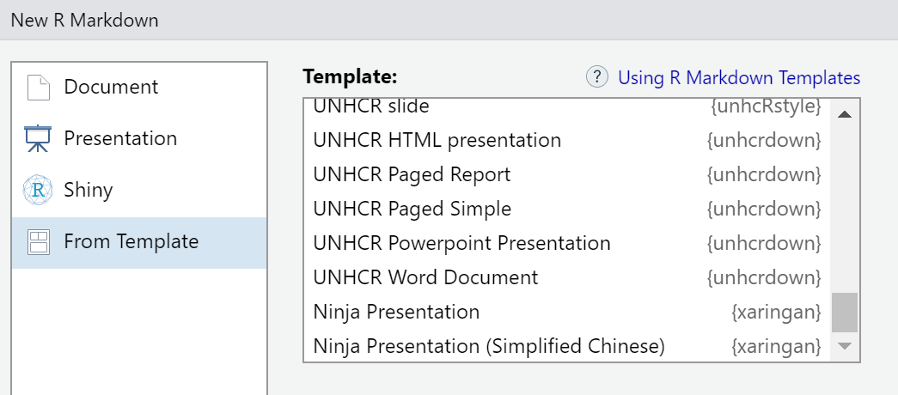

<!-- README.md is generated from README.Rmd. Please edit that file -->

```{r, include = FALSE}
knitr::opts_chunk$set(
  collapse = TRUE,
  comment = "#>",
  fig.path = "man/figures/README-",
  out.width = "100%"
)
```

# unhcrdown <a href="https://github.com/vidonne/unhcrdown"></a>

<!-- badges: start -->
[](https://www.repostatus.org/#wip)
[](https://github.com/vidonne/unhcrdown/actions)
[](https://CRAN.R-project.org/package=unhcrdown)
<!-- badges: end -->

## Overview

The **`unhcrdown`** package provides a set of templates following [UNHCR Brand](https://www.unhcr.org/brand) recommendations. The goal of this package is to ease and speed up the creation of reports, presentation and website while promoting the UNHCR visual identity. 

## Installation

This package is not on yet on CRAN and to install it, you will need the remotes package.

```{r, eval = FALSE}
# install.packages("remotes")
remotes::install_github("vidonne/unhcrdown")
```

## Content

A package with all **necessary templates** to quickly create [UNHCR branded](https://www.unhcr.org/brand/templates-tools/) reports, presentations and more:

1. Microsoft **Word document** (based on `officedown::rdocx_document`)
2. HTML to **PDF paged reports** (based on `pagedown::html_paged`)
    - `unhcrdown::paged_report`, advanced report template including page cover, table of content, back-cover and more.
    - `unhcrdown::paged_simple`, simple document template to create quick reports, updates, etc.
3. Microsoft **PowerPoint presentation** (based on `officedown::rpptx_document`)
4. **HTML slides** (based on `xaringan::moon_reader`)

**Work in progress:**

1. HTML document (based on `rmarkdown::html_document`)
2. [Distill](https://rstudio.github.io/distill/)
3. [Rolldown](https://github.com/yihui/rolldown)

## Usage

The `unhcrdown` templates are designed for R Markdown projects, simply use the `docx_simple`, `paged_report` or `paged_simple`, `pptx_slides`, or `html_slides` engine in your R Markdown header. For example:

```yaml
---
title: "UNHCR Branded Rmarkdown"
author: First Last Name
date: "`r format(Sys.time(), '%d %B, %Y')`"
output: unhcrdown::paged_report
---
```

### Templates

You can also open a `unhcrdown` template using **RStudio**.

**Step 1:** Click the "File" menu then "New File" and choose "R Markdown".

```{r out.width='60%', echo=FALSE, dpi = 600}
knitr::include_graphics("man/figures/new_rmd.png")
```

**Step 2:** In the "From Template" tab, choose one of the built-in templates.

```{r out.width='60%', echo=FALSE, dpi = 600}

```


```{r child="man/rmdfragments/unhcrverse.Rmd"} 
```

## Meta

- Please [report any issues or bugs](https://github.com/vidonne/unhcrdown/issues).
- License: MIT
- Please note that this project is released with a [Contributor Code of Conduct](https://github.com/vidonne/unhcrdown/blob/master/CODE_OF_CONDUCT.md). By contributing to this project, you agree to abide by its terms.
