```{r, include = FALSE}
knitr::opts_chunk$set(
  warning = FALSE,
  message = FALSE
)
```

```{r setup, include=FALSE}
library(unhcrdown)
library(fontawesome)
```


## Template

The **`unhcrdown::html_slides`** template uses the [xaringan](https://slides.yihui.org/xaringan/#1) package for **creating UNHCR branded HTML presentations** with [remark.js](https://remarkjs.com/#1) through R Markdown.

<span id="yaml_code">To create a UNHCR branded HTML presentation, just create a new R Markdown document with the YAML section, as shown below:</span>

```yaml
---
title: "Main presentation title"
subtitle: "Subtitle if needed"
author: "Your name"
institute: "Bureau/Divisions"
date: "`r format(Sys.Date(),  '%d %B %Y')`"
output:
  unhcrdown::html_slides:
    self_contained: true
    nature:
      highlightStyle: github
      highlightLines: true
      countIncrementalSlides: false
      ratio: "16:9"
---
```

or just open the template provided, if you are using RStudio IDE (see [here](https://vidonne.github.io/unhcrdown/)).

Click the `Knit` button to compile it and you get the title slide of your presentation.

**Default title slide:**

:::{.mb-5}
```{r, echo=FALSE, out.width="100%", output.class=c("border","mb-5")}
knitr::include_graphics("../man/figures/html_slides_title.png")
```
:::

### YAML

Not all the `unhcrdown::html_slides` YAML arguments are mandatory. For example, include only the `title` if sufficient for your presentation. All the arguments, coming after the `unhcrdown::html_slides` call, are part of the **xaringan** package. See the help page `?xaringan::moon_reader` for all possible configurations. The template skeleton or above YAML example uses the recommended setup.

### Navigate

Press **h** or **?** to see the `remark.js` [keyboard shortcuts](https://bookdown.org/yihui/rmarkdown/xaringan-key.html), to help you navigate your presentation.

**Navigation shortcuts:**

:::{.mb-5}
```{r, echo=FALSE, out.width="100%"}
knitr::include_graphics("../man/figures/html_slides_revealjs_help.png")
```
:::

Common presenting workflow, if you have two screens:

- Press **c** to clone your presentation
- **On the presentation screen:** Move cloned window here, then press **f** for full-screen mode
- **On the extra screen:** Press **p** for presenter mode. See below on how to add [presenter notes](#presenter)

## Basic slides

Other than the title slide, the default style is top-left aligned content on a white background. The template includes some helper classes to override the default and create custom  slides, such as a section break.

### Usage

- Slide content starts immediately after the YAML ends
- Use 3 dashes in a row `---` on a line by itself to create a new slide
- Use 2 dashes in a row `--` for incremental content
- <span id="presenter">Presenter notes can be created using `???`</span>

**Simple R Markdown example:**

:::{.mb-5}
```
---
title: "Main presentation title"
output:unhcrdown::html_slides
---

# Slide one

* First bullet

--

* Second bullet

-- 
  
* Third bullet

???
Notes on slide 1

---

# Slide Two

Lorem ispum...

```
:::

### Alignement

Use the following classes to align content within a slide:

- **Horizontal alignment:** `left`, `center`, `right`
- **Vertical alignment:** `top`, `middle`, `bottom`

The alignment classes can be applied to the whole slide or to specific content within a slide. A mix of vertical and horizontal alignment can be used to affect the position of the entire slide content. By default, the content is `top-left` aligned. 

**Whole slide alignment:**

```
---
class: middle, center

# Middle-center
```

:::{.border .mb-5}
```{r, echo=FALSE, out.width="100%"}
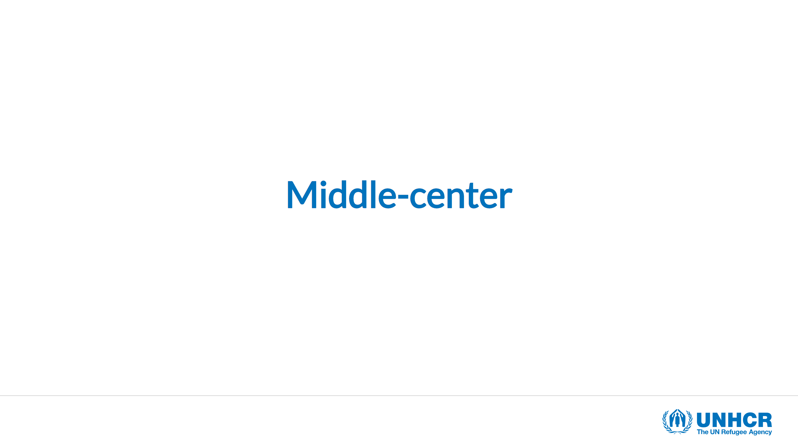
```
:::

The horizontal alignment classes can **only** also be used to move specific content within the overall slide alignment.

**Content alignment:**

```
---
class: middle, center

# Middle-center

.left[This text will appear on the **left side** of the slide]
```
:::{.border .mb-5}
```{r, echo=FALSE, out.width="100%"}
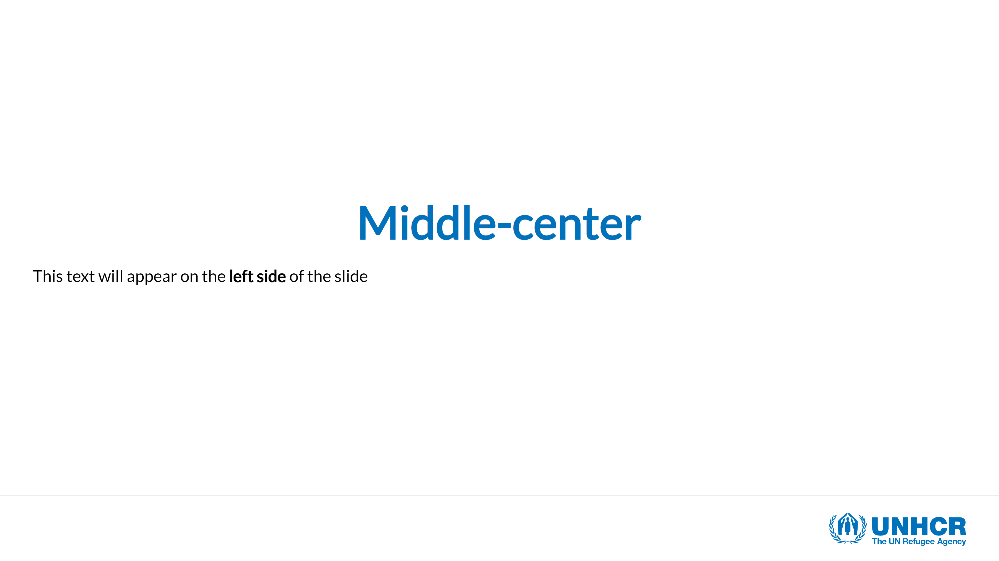
```
:::

### Layout

You can place content to the left or right using the following classes `.pull-left[]` and `.pull-right[]`. This will create a two-column layout, where each column take up to 47% of the page width. All the column content needs to go within the respective `[]`. You can similarly use `.left-column[]` and `.right-column[]`, the sizes are then 20% and 75%.

**Basic two columns layout:**

```
# Two columns

Each column takes 47% of the total width

.pull-left[Lorem ipsum...]

.pull-right[Lorem ipsum...]
```
:::{.border .mb-5}
```{r, echo=FALSE, out.width="100%"}
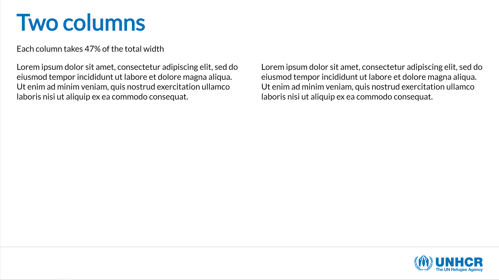
```
:::

The layout classes are really helpful and can create a complex layout by nesting them:

**Advanced layout example:**

```
---
# Columns within columns

.pull-left[
.pull-left[
### Col 1.1
This is a `.pull-left[]` within a `.pull-left[]`
]
.pull-right[
### Col 1.2
This is a `.pull-right[]` within a `.pull-left[]`
]
]

.pull-right[
.pull-left[
### Col 2.1
This is a `.pull-left[]` within a `.pull-right[]`
]
.pull-right[
### Col 2.2
This is a `.pull-right[]` within a `.pull-right[]`
]
]
```

:::{.border .mb-5}
```{r, echo=FALSE, out.width="100%"}
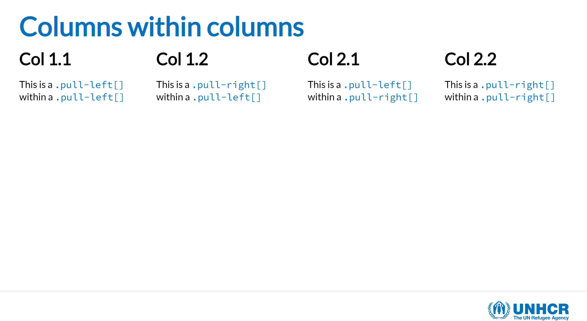
```
:::

### UNHCR helpers

To further ease the creation of UNHCR branded presentations some specific classes have been added to further stylize the content of a slide. The font family and styles are already set to fit within the brand, but in some cases you might need more flexibility.

Some classes allow to alter the text size, colour and background:

* **Text size:** `.large[]` and `.small[]`
* **Text colour:** `.blue[]` and `.grey[]`
* **Text background colour:** `.bg-blue[]` and `.bg-grey[]`

**Slide example with helper classes:**

```
---
# UNHCR Helpers

You can change the **size** of the text by using the `.large[]` or `.small[]` class

.large[Large text] followed by .small[small text] example

You can change the **colour** of the text by using the `.blue[]` or `.grey[]` class

.blue[Blue text] followed by .grey[grey text] example

You can change the **background** of the text by using the `.bg-blue[]` or `.bg-grey[]` class

.bg-blue[All this text will be in a blue background]
```

:::{.border .mb-5}
```{r, echo=FALSE, out.width="100%"}
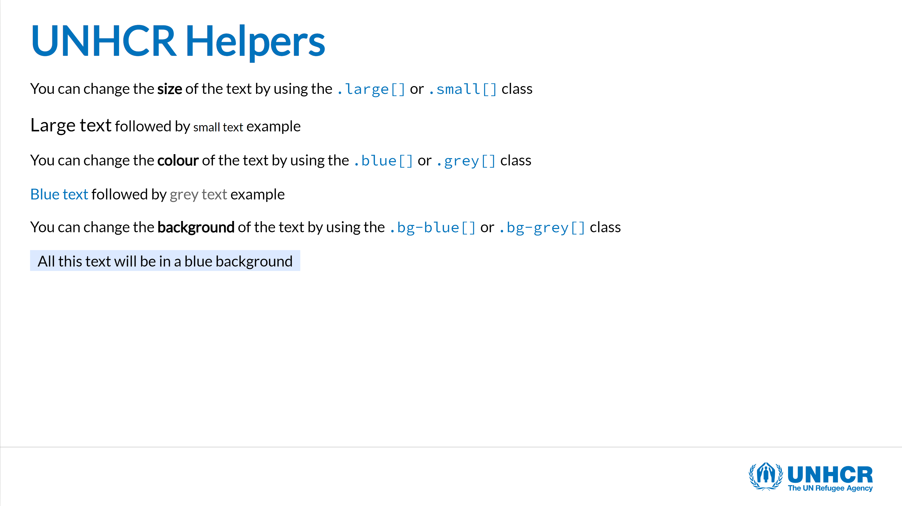
```
:::

### Images and icons

Depending on your needs and control over the image output, you can use the following approaches to include images in your slides:

* Inline R Markdown: ``
* [Knitr](https://www.rdocumentation.org/packages/knitr/versions/1.30/topics/include_graphics): `knitr::include_graphics("path_to_image")`
* Plain [HTML](https://www.w3schools.com/html/html_images.asp): ``

The brand unit recommends the use of the [Humanitarian icons](https://brand.unocha.org/d/xEPytAUjC3sH/icons) which are now part of the [Fontawesome](https://fontawesome.com/icons/categories/humanitarian) set. We recommend the use of the [`fontawesome`](https://rstudio.github.io/fontawesome/) R package. Simply install and load the package to directly access the whole Fontawesome set:

* <code>r fa("hands-holding-circle", fill = "var(--unhcr-blue)")</code> = `r fa("hands-holding-circle", fill = "#0072bc")`

### Background

**Colour:**

The default slide background is white, but you can apply a branded UNHCR blue by adding the class `inverse` to the slide. This can be useful to create a section break in your presentation. The `inverse` class can be coupled with the alignment classes.

**Inverse background example:**

```
---
class: inverse

# Blue background slide
```
:::{.mb-5}
```{r, echo=FALSE, out.width="100%"}
knitr::include_graphics("../man/figures/html_slides_inverse.png")
```
:::

**Image:**

* You can specify a background image (or multiple images) at the start of your slide just like you did the class for the background colour:

```
---
background-image: url(path_to_image)
background-size: cover
background-position: center
```

* Options for `background-size` include:

   * `cover` will cover the slide so that there is no white space (may cut tops/sides)
   * `contain` fits to slide height-wise
   
* See [here](https://www.w3schools.com/cssref/pr_background-position.asp) on how you can play around with background position.

* Play with the `inverse` class of the slide depending on the logo colour that works better with your picture. If needed, you can remove the logo altogether by putting the `hide-logo` class.

**Image background example:**

```
---
class: hide-logo
background-image: url(https://raw.githubusercontent.com/vidonne/unhcrdown/master/inst/resources/img/cover-example.jpg)
background-size: cover
background-position: center 25%
```
:::{.mb-5}
```{r, echo=FALSE, out.width="100%"}
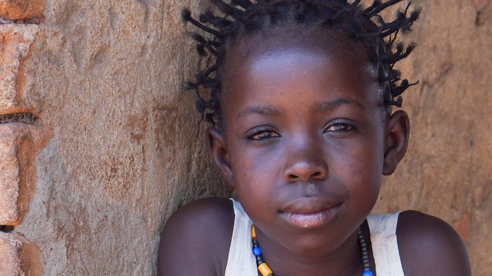
```
:::

## R content

Because **`unhcrdown::html_slides`** is an R Markdown document you can natively include R code chunks as well as tables and plots.

### Highlighting code

If you use the **`unhcrdown::html_slides`** skeleton template or copy the [YAML](#yaml_code) at the top of the page, the highlighting code option will be **turned on** by default. To change this behavior simply edit the following YAML lines. All the highlight style options can be found [here](https://github.com/gnab/remark/wiki/Configuration):

```
nature:
      highlightStyle: github
      highlightLines: true
```

To highlight lines of code simply add `#<<` at the end of each targeted row and a light yellow background will be added.

**Highlighting code:**

:::{.border .mb-5}
```{r, echo=FALSE, out.width="100%"}
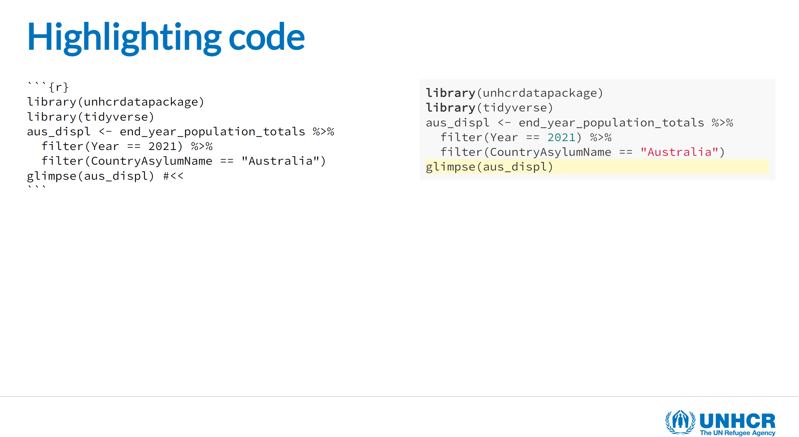
```
:::

It is also possible to highlight the code output by adding `highlight.output = c(3,4)` to the code chunk options.

**Highlighting code output:**

:::{.border .mb-5}
```{r, echo=FALSE, out.width="100%"}
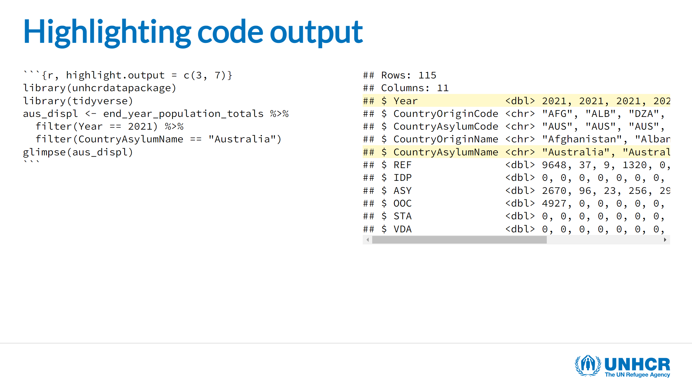
```
:::

### Tables

You can display a table directly in an R chunk, but for a simple table we recommend the use of `kable` from the `knitr` package. To ensure the proper representation of the table, make sure to add the format HTML to your `kable` call: `knitr::kable(format = "html")`. You can also set this as a global option for all your slides using `options(knitr.table.format = "html")`.

The `kable` function can also help format the output format, like formatting numbers, changing column names or adding a caption. You can see more information on `kable` and what it can do  [here](https://bookdown.org/yihui/rmarkdown-cookbook/kable.html).

**Simple kable table:**

```
head(aus_displ) |> 
  knitr::kable(format = "html",
               col.names = c("Country of origin", "Country of asylum",
                            "Population type", "Number of people"),
               caption = "Displaced population in Australia | 2021")
```
:::{.border .mb-5}
```{r, echo=FALSE, out.width="100%"}
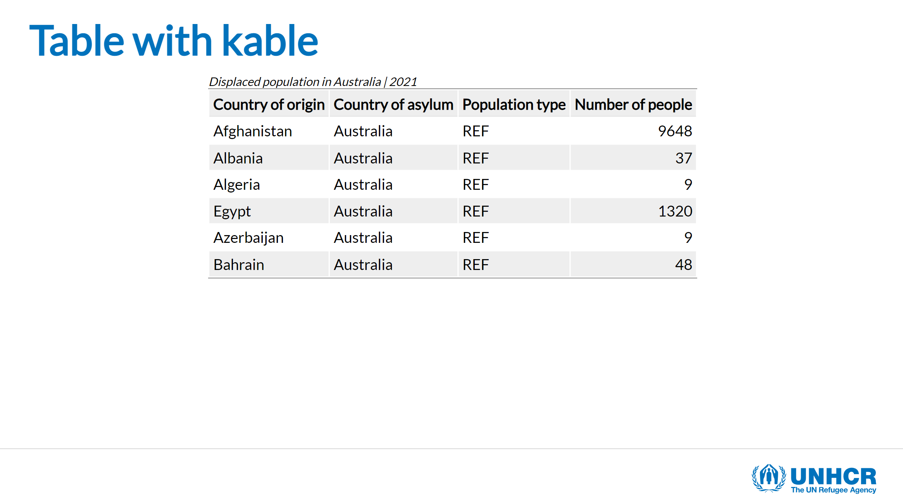
```
:::

For more flexibility and advanced table style refer to other R packages like [`GT`](https://gt.rstudio.com/) for static tables or [`DT`](https://rstudio.github.io/DT/) if you need some interactivity.

#### UNHCR table classes

For simple tables, we included a series of **classes** that can be applied to the `kable` output format. Simply add the required class names to the `table.attr` parameter of the `kable` call, don't forget to use `\` to escape the quote character.

The following classes are available:

* `.table`: initiate the possibility to stylize the table and provide base style. This class is **mandatory**.
* `.table-blue`: add light blue background for alternate rows.
* `.table-grey`: add light grey background for alternate rows.
* `.table-narrow`: when `.table` is set, the width is 100%. `.table-narrow` allows to fit the width to the content.
* `.table-noborder`: remove all borders from the table.

**Kable table with UNHCR classes:**

```
head(aus_displ) |> 
  knitr::kable(format = "html",
               col.names = c("Country of origin", "Country of asylum", "Population type", "Number of people"),
               caption = "Displaced population in Australia | 2021",
               table.attr = "class=\"table  table-blue table-narrow table-noborder\"")
```
:::{.border .mb-5}
```{r, echo=FALSE, out.width="100%"}
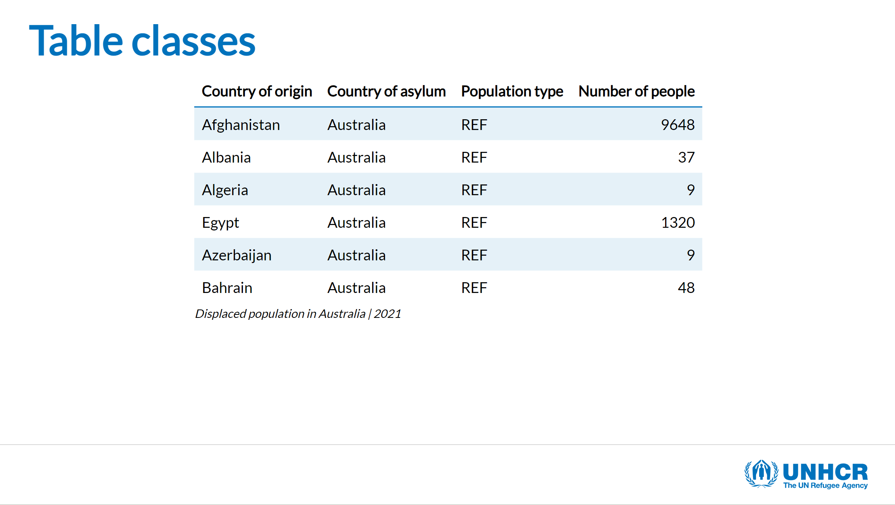
```
:::

### Plots

For the creation of charts, we recommend the use of the [**`unhcrthemes`**](https://vidonne.github.io/unhcrthemes/index.html) as it provides a `ggplot2` theme and a set of colour palettes for making charts and graphics based on the [UNHCR Data Visualization Guidelines](https://dataviz.unhcr.org/general_guidance/). The charts made with [`unhcrthemes`](https://vidonne.github.io/unhcrthemes/index.html) will be perfectly integrated in the `unhcrdown::html_slides` presentation and will be fully aligned with the UNHCR brand.

Inserting a plot is as easy as a table and only requires a few lines of code. For more information on how to make a plot using `unhcrthemes` please refer to [package documentation](https://vidonne.github.io/unhcrthemes/articles/intro-unhcrthemes.html) and the [UNHCR Data Visualization Platform R tutorials](https://dataviz.unhcr.org/tools/r/).

**`unhcrthemes` plot example:**

````
```{r, fig.showtext = TRUE, fig.retina = 4, out.width="60%", fig.height=5}`r ''`
library(tidyverse)
library(scales)
library(unhcrthemes)

idp_total_sex <- idp |>
  group_by(year, sex) |>
  summarise(idp = sum(idp, na.rm = TRUE) / 1e6) |>
  ungroup()

ggplot(idp_total_sex) +
  geom_col(aes(x = year, y = idp, fill = sex),
           width = 0.8,
           position = position_dodge(width = 0.9)) +
  scale_fill_unhcr_d(palette = "pal_unhcr") +
  scale_y_continuous(expand = expansion(c(0, 0.1))) +
  labs(title = "Globalement IDP displacement | 2010 - 2020",
       y = "Number of people (in million)",
       caption = "Source: UNHCR Refugee Data Finder\n© UNHCR, The UN Refugee Agency") +
  scale_x_continuous(breaks = pretty_breaks(10)) +
  theme_unhcr(grid = "Y", axis_title = "y")
```
````
:::{.border .mb-5}
```{r, echo=FALSE, out.width="100%"}
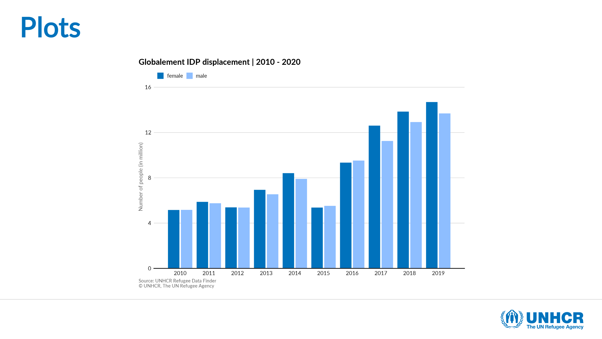
```
:::

Getting your plot right is not always easy, but you can control your plots by playing with individual chunk options like `fig.retina` and `out.width` (plus `fig.width` and `fig.height`). Often this requires some trial and error, but look at [html_slides sample presentation](#) or the **template skeleton** for setup examples. Also check Hadley/Garrett's recommended [ggplot2 chunk options](https://r4ds.had.co.nz/graphics-for-communication.html#figure-sizing) and Christophe Nicault blog's post on [understanding text size and resolution in ggplot2](https://www.christophenicault.com/post/understand_size_dimension_ggplot2/) for guidance. 

You can also set your global chunk options in a setup chunk, all the code chunk following the setup will get the same options. This can always be overridden by setting the desired parameter in the required code chunk. As `unhcrthemes` package use specific fonts it's always a good thing to include the `showtext` setup to avoid unexpected results:

````
```{r setup}`r ''`
knitr::opts_chunk$set(message = FALSE, warning = FALSE, fig.showtext = TRUE, fig.retina = 4)
```
````

**Show code alongside resulting plot:**

A nice tip for the purpose of teaching is to use the `fig.show` and the `ref.label` code chunk options to avoid repeating your code.

* Chunk showing code: `` {r plot-name, fig.show = 'hide'} ``
* Chunk showing plot: `` {r ref.label = 'plot-name', echo = FALSE} ``

:::{.border .mb-5}
```{r, echo=FALSE, out.width="100%"}
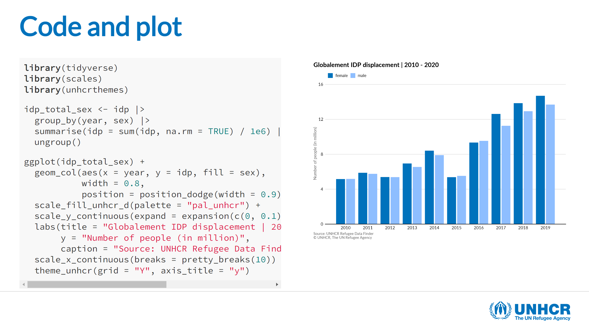
```
:::

### Scrolling R output

We would recommend making sure your content fits the height of the slide but sometimes R output can be extensive. For this scenario, we included some custom classes depending on how many lines you want to show, just wrap the targeted content in the desired class:

* `.scroll-box-8[]`: show 8 lines
* `.scroll-box-10[]`: show 10 lines
* `.scroll-box-12[]`: show 12 lines
* `.scroll-box-14[]`: show 14 lines
* `.scroll-box-16[]`: show 16 lines
* `.scroll-box-18[]`: show 18 lines
* `.scroll-box-20[]`: show 20 lines

<small>Thanks to [Garth Tarr from the University of Sydney](https://garthtarr.github.io/sydney_xaringan/#13) for the idea.</small>
